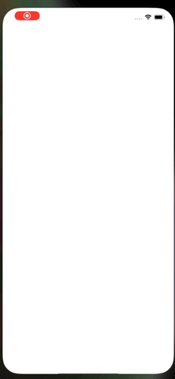

# iOS Simple Google RSS Reader

Get the latest News from Google RSS.

# Architecture
- MVVM : SwiftUI + Combine

# Requirements
- Swift 5.1
- iOS 13.0 + (SwiftUI, Combine)

# Dependencies
- [Kingfisher](https://github.com/onevcat/Kingfisher)
- [SwiftSoup](https://github.com/scinfu/SwiftSoup)
- [SwiftUIRefresh](https://github.com/siteline/SwiftUIRefresh)

# Description

This sample project parses the Google News RSS by applying the MVVM design pattern with SwiftUI and Combine and shows the results as a list.
